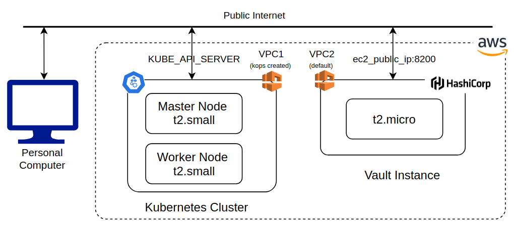
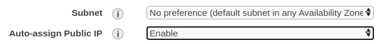
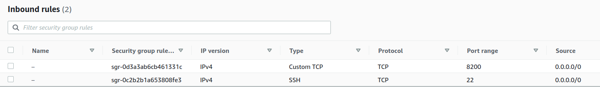

## Introduction 
This project demonstrates using the [kubernetes](https://www.vaultproject.io/docs/auth/kubernete) authentication method to authenticate to Hashicorp vault. I'll assume familiarity with basic concepts of using vault such as [policies](https://learn.hashicorp.com/tutorials/vault/policies) and [roles](https://www.vaultproject.io/docs/auth/approle) and a good understanding of Kubernetes, particularly RBAC and Service Accounts. 

Set up involves the following steps:
#### One time setup:
- Create a Kubernetes Service Account (SA) with access to TokenReview API
- Configure vault kubernetes config with this service account JWT and Kubernetes CA crt so vault can reach Kubernetes [TokenReview API](https://kubernetes.io/docs/reference/access-authn-authz/authentication/) to authenticate service account JWTs passed by application pods. 

#### Application specific setup
- Create an application specific Kubernetes service account
- Create a vault policy that enables CRUD operations at a certain path on a vault secrets engine
- Create a vault role associating the service account with the policy

Now a Kubernetes pod using this service account can pass the SA JWT stored in `/var/run/secrets/kubernetes.io/serviceaccount/token` as a bearer token to authenticate with vault and receive a client_token that can be used to perform CRUD operations, as permitted by the policy associated with the role. Internally, Vault uses the Kubernetes TokenReview API to verify the JWT. See this [sequence diagram](https://learn.hashicorp.com/tutorials/vault/agent-kubernetes?in=vault/kubernetes) for more details. In summary, vault posts to the TokenReview API by passing the first SA (with TokenReview API access) in the header and the application SA in the payload. TokenReview API responds with a suitable response that indicates whether the SA JWT is valid. Upon successful authentication, vault checks if the application SA is authorized to use the role requested and responds with a client_token with allowed policies attached. This client_token can be used for all future secret requests as long as the token is valid. 

## System Architecture
In my setup, vault is installed on an AWS t2.micro EC2 instance. I use kops to set up a small Kubernetes cluster consisting of a master and worker node (both t2.small EC2 instances). The vault EC2 instance doesn't need to be on the same VPC as the Kubernetes cluster. I communicate with the Kubernetes cluster and vault using my home Ubuntu workstation.



## Setup
### Kubernetes setup
I use [kops](https://kops.sigs.k8s.io/getting_started/aws/) to set up a small Kubernetes cluster on AWS consisting of one master and one worker node of t2.small instance type. I used the `ubuntu/images/hvm-ssd/ubuntu-focal-20.04-amd64-server` AMI for each node. Make sure that the architecture of your Kubernetes cluster instances (x86_64 or ARM) matches the architecture of the development workstation where you'll be creating the application docker image. I was using the t4g.micro instances earlier for my worker nodes, which only support ARM64 images, while my workstation is a x86_64 machine. Because of the architecture mismatch, the docker images built on my x86 workstation were not working on the Kubernetes cluster and it took me some head scratching to figure out why. A potential workaround could be to create multi-platform docker images using [docker buildx](https://docs.docker.com/buildx/working-with-buildx/#build-multi-platform-images), but I haven't tried this yet. 

### Vault setup
The vault setup involves launching a publicly accessible EC2 instance and installing vault on it as shown below. The EC2 instance can be in the same VPC as the Kubernetes cluster or in a different VPC. 
- Launch a t2.micro EC2 instance using the AWS EC2 console
- Select the Amazon Linux 2 AMI (make sure the architecture matches your development workstation)
- In "Configure Instance Details", ensure Auto-assign Public IP is set to Enable, so that a public IP is assigned to your instance

- Make sure you have the ssh key to ssh into the instance 
- Once the instance is up and running, modify the security group Inbound Rules to allow TCP traffic on port 8200, the default port used by vault

- ssh into your ec2 instance (ec2-user is the default user on AWS) and install vault using instructions [here](https://learn.hashicorp.com/tutorials/vault/getting-started-install?in=vault/getting-started)
- Deploy vault using instructions [here](https://learn.hashicorp.com/tutorials/vault/getting-started-deploy?in=vault/getting-started). I modified the listener setting in config.hcl to ensure the vault server is accessible from outside, like this:
```angular2
listener "tcp" {
  address     = "0.0.0.0:8200"
  tls_disable = "true"
}
```

- Copy the root vault token shown during deployment. You can also create a new root token using `vault token create`
- Enable the vault secrets engine 
```angular2
vault secrets enable kv
```  
- Verify secret engine is mounted at path kv/ using `vault secrets list -detailed`

- Turn on kuberetes iam authentication method `vault auth enable kubernetes`

### Verifying connectivity
#### Reaching vault from local computer
To confirm that you are able to connect to vault from your local computer by issuing a curl command, try running the following from a local terminal
```angular2
 curl -H "X-Vault-Token: <your token>" -X LIST  http://<your_vault_server_public ip>:8200/v1/kv/
```
The vault access token was obtained earlier during Vault setup. 
If you get some response back, you are able to reach the vault server. 

#### Reaching Kubernetes cluster from Vault EC2 instance
Next, let's ensure we are able to reach the Kubernetes cluster from Vault. This is necessary because Vault will use the Kubernetes TokenReview API to verify the service account token provided in the authentication request. If Vault is unable to reach the Kubernetes cluster, authentication will fail.
- Get the fully qualified DNS name of the Kubernetes API server
```angular2
APISERVER=$(kubectl config view --raw --minify --flatten     --output 'jsonpath={.clusters[].cluster.server}')
```
- Get the service account token for the default service account
```angular2
TOKEN=$(kubectl get secrets -o jsonpath="{.items[?(@.metadata.annotations['kubernetes\.io/service-account\.name']=='default')].data.token}"|base64 --decode)
```
- ssh to the EC2 instance running vault and set APISERVER and TOKEN to the values above. Then run:
```angular2
 curl -X GET $APISERVER/api --header "Authorization: Bearer $TOKEN" --insecure
```
If you get some valid response, Kubernetes cluster is accessible to the EC2 instance running Vault. 

### One time setup 
- Create SA with access to the TokenReview API
```angular2
kubectl create sa vault-auth
``` 
Now give this SA access to the TokenReview API by creating a ClusterRoleBinding that attaches the [auth-delegator](https://kubernetes.io/docs/reference/access-authn-authz/rbac/#other-component-roles) role
```angular2
kubectl apply -f vault-auth-sa.yaml
``` 
- Run `k8s_vault_setup.sh` passing in the IP address of the EC2 instance running vault as argument. This script will configure vault kubernetes auth by passing the TokenReview SA JWT and CA cert. This info will be used by vault to talk to Kubernetes TokenReview API to authenticate SA JWTs passed by Kubernetes pods during authentication. 

### Application setup
Now, we'll create another application specific SA and run a Kubernetes pod in this SA. This pod will create a vault policy that enables CRUD operations at a certain path on the vault kv secrets engine, 
a vault role associating the service account with the policy, and authenticate to vault kubernetes auth. Upon successful authentication, it will receive a client_token that can be used to write/read secrets. 

The pod needs the vault root token to create the vault policy and role. Typically, creation of service account, vault policy and vault role is an admin task that is performed once during application setup. During normal operations, an application should simply authenticate to vault using the SA JWT attached to the pod and access the secrets it is allowed and thus shouldn't need a root token. However, our application creates the vault role and policy also just for sake of example. 

- Create an application SA
```angular2
kubectl create sa vault-app-auth
```
- Edit VAULT_ADDR and VAULT_ROOT_TOKEN fields in vault_settings.cfg and create a config map
```angular2
kubectl create cm vault-k8s-auth --from-env-file=vault_settings.cfg
```
- Create a docker image containing the application code and push it to DockerHub
```angular2
docker build -t <image_name>
```
- Edit the image name in vault_k8s_auth.yaml and run the pod:
```angular2
kubectl apply -f vault_k8s_auth.yaml
```
- Exec into the pod and run vault_k8s_auth.py (you can also change the default command in the pod yaml to run the script directly)
```angular2
kubectl exec --stdin --tty vault-k8s-auth -- python vault_k8s_auth.py
```
